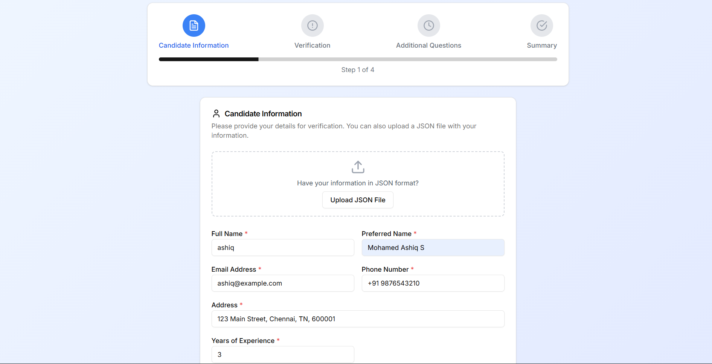
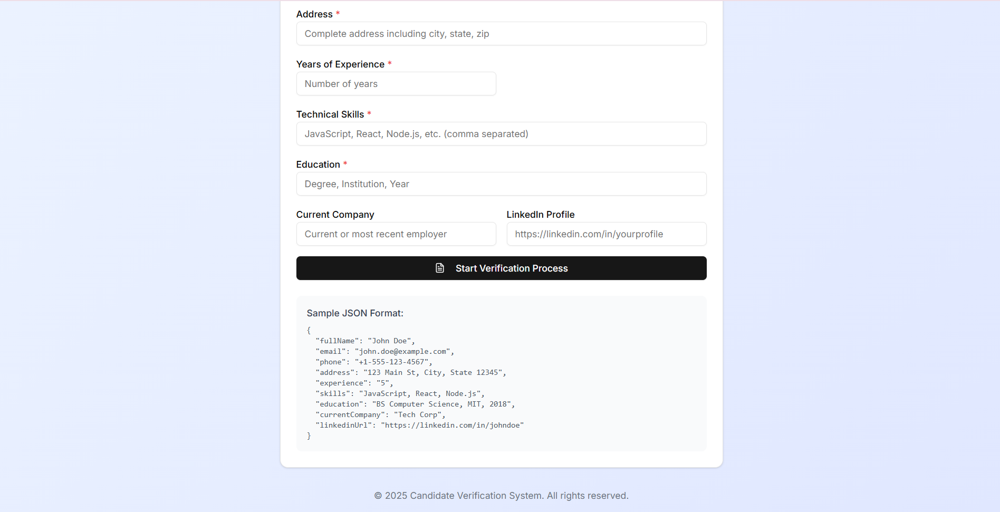
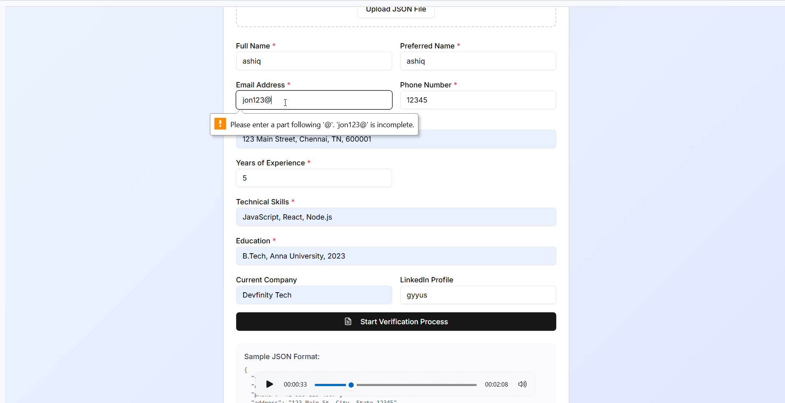
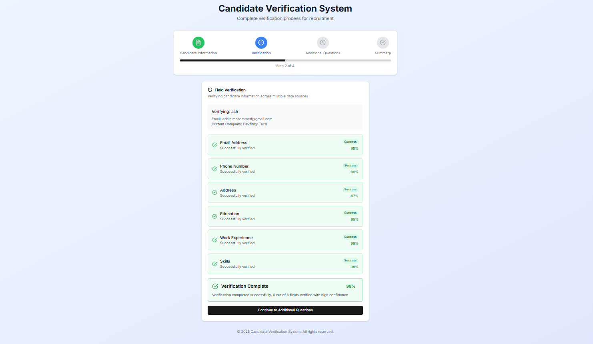
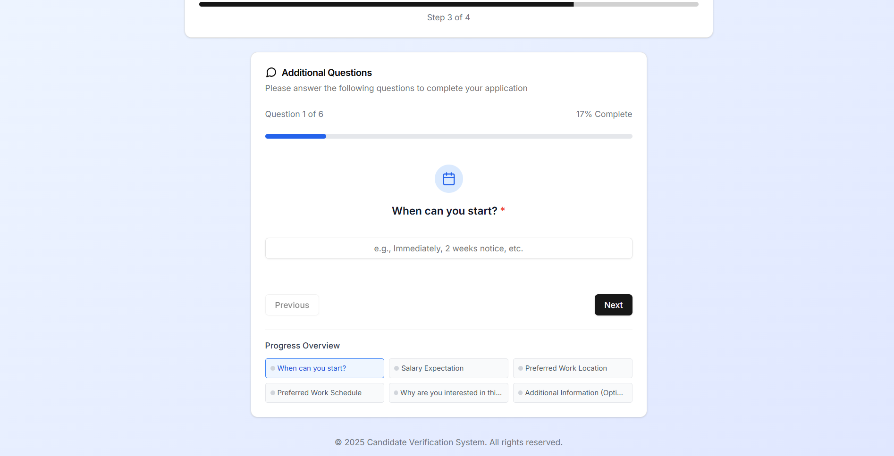
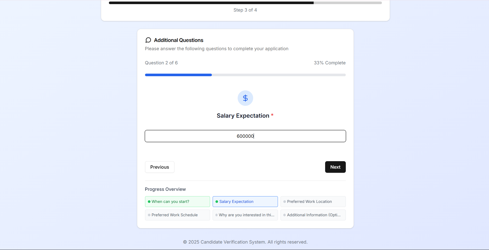
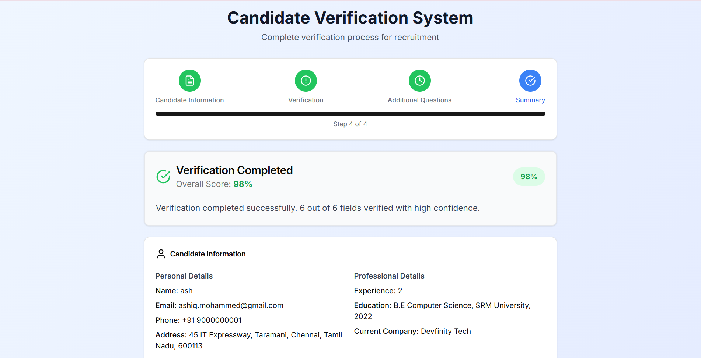
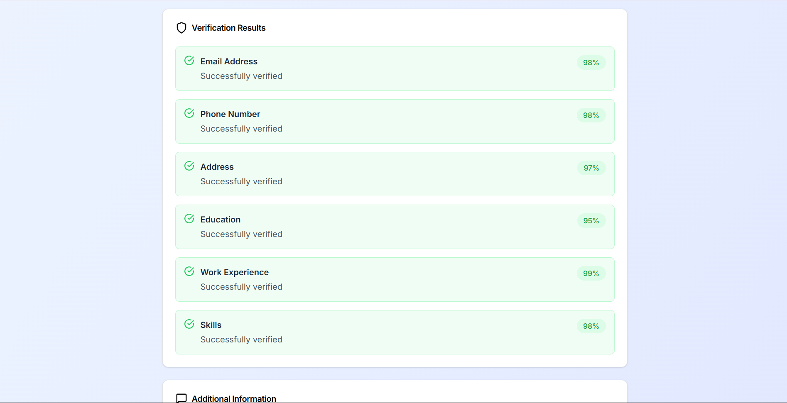
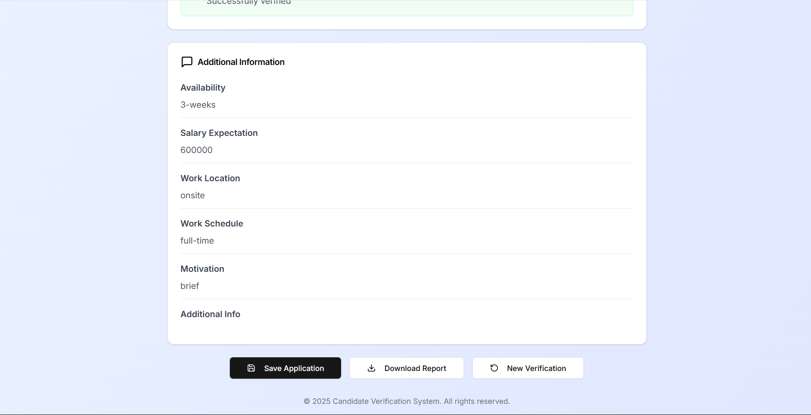

# Candidate-Verifier - Take Home Assignment

## 📋 Project Overview

A comprehensive web-based candidate verification system that simulates a real screening flow. The application loads candidate data, validates existing fields, asks additional configured questions, and allows users to correct, confirm, or fill missing information. The system provides a clean, structured output with verification results.

## 🎥 Demo & Screenshots

### Working Demo
📺 **Live Demo Video**: [YouTube Link](https://www.youtube.com/watch?v=90BI-0NnEtc)

*Replace `YOUR_YOUTUBE_VIDEO_LINK` with your actual YouTube video URL*

### Application Screenshots

#### 1. Initial Data Collection

*Initial candidate information form interface*


*JSON file upload option for pre-filled data*


*Real-time form validation and error handling*

#### 2. Field Verification Process

*Real-time verification process with progress indicators*

#### 3. Additional Questions

*Step-by-step additional question collection interface*


*Continuation of additional questions with different field types*

#### 4. Verification Summary

*Comprehensive verification report with scoring overview*


*Detailed verification results and export functionality*


*Detailed verification results and export functionality*

*Note: Place your actual screenshots in a `screenshots/` folder in your repository root*

## 🎯 Objective

This project demonstrates the ability to:
- Design dynamic data-driven flows
- Manage complex validation logic
- Support extensibility through configurable questions
- Create an intuitive frontend interface
- Generate structured verification reports

## ✨ Features

### Core Functionality
- **Dynamic Field Validation**: Validates candidate information with real-time feedback
- **Interactive Verification Process**: Step-by-step verification with visual progress indicators
- **Additional Questions Module**: Configurable additional questions with different field types
- **Smart Field Verification**: Simulated verification process with scoring system
- **Comprehensive Summary**: Detailed verification report with overall scoring
- **Export Functionality**: Download verification reports as JSON files
- **Responsive Design**: Works seamlessly across desktop and mobile devices

### Advanced Features
- **JSON File Upload**: Support for pre-filled candidate data via JSON upload
- **Multi-step Form Flow**: Progressive disclosure of information collection
- **Real-time Validation**: Immediate feedback on field validation errors
- **Visual Progress Tracking**: Progress bars and status indicators throughout the process
- **Professional UI/UX**: Modern, clean interface with consistent design patterns

## 🏗️ Architecture

### Frontend Components
- **CandidateVerifier.tsx**: Initial data collection and validation
- **FieldVerification.tsx**: Simulated verification process with scoring
- **AdditionalQuestions.tsx**: Dynamic question collection module
- **Summary.tsx**: Final verification report and export functionality

### Technology Stack
- **Frontend**: Next.js 15 , TypeScript
- **Styling**: Tailwind CSS, shadcn/ui components
- **Icons**: Lucide React
- **State Management**: React Hooks (useState, useEffect)
- **File Handling**: Browser File API for JSON upload

## 🚀 Setup & Installation

### Prerequisites
- Node.js 18+ 
- npm or yarn package manager

### Installation Steps

1. **Clone the repository**
   ```bash
   git clone https://github.com/MohamedAshiq09/candidate-verifier.git
   cd candidate-verifier
   ```

2. **Install dependencies**
   ```bash
   npm install
   # or
   yarn install
   ```

3. **Run the development server**
   ```bash
   npm run dev
   # or
   yarn dev
   ```

4. **Open in browser**
   Navigate to `http://localhost:3000`

### Production Build
```bash
npm run build
npm start
```

## 📁 File Structure

```
├── components/
│   ├── CandidateVerifier.tsx    # Initial data collection
│   ├── FieldVerification.tsx    # Verification process
│   ├── AdditionalQuestions.tsx  # Additional questions
│   ├── Summary.tsx              # Final report
│   └── ui/                      # UI components
├── types/
│   └── index.ts                 # TypeScript interfaces
├── app/
│   ├── page.tsx                 # Main application
│   └── layout.tsx               # Root layout
└── public/
    └── sample-data/
        └── input.json           # Sample input file
```

## 📊 Input/Output Format

### Input Format (input.json)
```json
{
  "candidateFields": [
    {
      "id": "fullName",
      "label": "Full Name",
      "type": "text",
      "required": true,
      "validation": "name"
    },
    {
      "id": "email",
      "label": "Email Address",
      "type": "email",
      "required": true,
      "validation": "email"
    },
    {
      "id": "phone",
      "label": "Phone Number",
      "type": "tel",
      "required": true,
      "validation": "phone"
    },
    {
      "id": "experience",
      "label": "Years of Experience",
      "type": "number",
      "required": true,
      "validation": "number",
      "min": 0,
      "max": 50
    },
    {
      "id": "skills",
      "label": "Technical Skills",
      "type": "text",
      "required": true,
      "validation": "skills",
      "placeholder": "React, Node.js, TypeScript..."
    },
    {
      "id": "education",
      "label": "Highest Education",
      "type": "select",
      "required": true,
      "options": [
        "High School",
        "Bachelor's Degree",
        "Master's Degree",
        "PhD",
        "Bootcamp/Certification"
      ]
    },
    {
      "id": "currentCompany",
      "label": "Current Company",
      "type": "text",
      "required": false,
      "validation": "text"
    },
    {
      "id": "linkedinUrl",
      "label": "LinkedIn Profile URL",
      "type": "url",
      "required": false,
      "validation": "url"
    }
  ],
  "additionalQuestions": [
    {
      "id": "availability",
      "question": "When can you start?",
      "type": "select",
      "options": ["Immediately", "2 weeks notice", "1 month", "More than 1 month"],
      "required": true
    },
    {
      "id": "salaryExpectation",
      "question": "Expected salary range (USD/year)?",
      "type": "select",
      "options": ["30k-50k", "50k-70k", "70k-100k", "100k-150k", "150k+"],
      "required": true
    },
    {
      "id": "remoteWork",
      "question": "Are you open to remote work?",
      "type": "radio",
      "options": ["Yes", "No", "Hybrid preferred"],
      "required": true
    },
    {
      "id": "motivation",
      "question": "Why are you interested in this position?",
      "type": "textarea",
      "required": true,
      "maxLength": 500
    }
  ],
  "verificationRules": {
    "email": {
      "checkDomain": true,
      "allowedDomains": ["gmail.com", "yahoo.com", "outlook.com", "hotmail.com"],
      "blockTempEmail": true
    },
    "skills": {
      "requiredSkills": ["React", "JavaScript", "TypeScript"],
      "bonusSkills": ["Node.js", "Next.js", "Python", "AWS", "Docker"]
    },
    "experience": {
      "minimumYears": 1
    }
  }
}
```

### Output Format (output.json)
```json
{
  "candidate": {
    "fullName": "ashiq",
    "name": "Mohamed Ashiq S",
    "email": "ashiq@example.com",
    "phone": "+91 9876543210",
    "address": "123 Main Street, Chennai, TN, 600001",
    "experience": "0",
    "skills": "JavaScript, React, Node.js",
    "education": "B.Tech, Anna University, 2023",
    "currentCompany": "Airosphere",
    "linkedinUrl": ""
  },
  "verification": {
    "fieldResults": [
      {
        "fieldId": "email",
        "fieldName": "Email Address",
        "status": "success",
        "message": "Successfully verified",
        "score": 99
      },
      {
        "fieldId": "phone",
        "fieldName": "Phone Number",
        "status": "success",
        "message": "Successfully verified",
        "score": 96
      },
      {
        "fieldId": "address",
        "fieldName": "Address",
        "status": "warning",
        "message": "Partially verified - requires manual review",
        "score": 79,
        "details": "Manual review required for complete verification"
      },
      {
        "fieldId": "education",
        "fieldName": "Education",
        "status": "success",
        "message": "Successfully verified",
        "score": 98
      },
      {
        "fieldId": "experience",
        "fieldName": "Work Experience",
        "status": "success",
        "message": "Successfully verified",
        "score": 95
      },
      {
        "fieldId": "skills",
        "fieldName": "Skills",
        "status": "success",
        "message": "Successfully verified",
        "score": 99
      }
    ],
    "overallScore": 94,
    "status": "passed",
    "summary": "Verification completed successfully. 5 out of 6 fields verified with high confidence."
  },
  "additionalAnswers": {
    "availability": "immediately",
    "salaryExpectation": "$6000000",
    "workLocation": "remote",
    "workSchedule": "full time ",
    "motivation": "just chiill and jsut vibe",
    "additionalInfo": ""
  },
  "generatedAt": "2025-07-01T07:51:56.680Z"
}
```

## 🔧 Validation Rules

| Field Type | Validation Rule |
|------------|----------------|
| **text** | Minimum 2 characters |
| **email** | Valid email regex pattern |
| **tel** | Valid phone number format |
| **number** | Integer or float, with min/max bounds |
| **url** | Valid URL format |
| **required** | Non-empty field validation |

## 🎮 User Flow

1. **Step 1**: Upload JSON file or manually enter candidate details
2. **Step 2**: System validates each field with real-time feedback
3. **Step 3**: Automated verification process with progress tracking
4. **Step 4**: Answer additional configured questions
5. **Step 5**: Review comprehensive summary report
6. **Step 6**: Save application and download verification report

## 💡 Design Choices

### Frontend Architecture
- **Component-based Design**: Modular React components for maintainability
- **TypeScript Integration**: Type safety and better developer experience
- **Progressive Enhancement**: Step-by-step flow with clear visual feedback

### Validation Strategy
- **Client-side Validation**: Immediate feedback for better UX
- **Simulated Verification**: Realistic verification process with weighted scoring
- **Error Handling**: Comprehensive error states and user guidance
- **Data Persistence**: In-memory state management during session

### UX/UI Decisions
- **Progress Indicators**: Clear visual feedback on process completion
- **Card-based Layout**: Clean, organized information presentation
- **Color-coded Status**: Intuitive color scheme for verification results
- **Accessibility**: Proper labeling and keyboard navigation support

## 🧪 Testing

### Manual Testing Scenarios
- ✅ Valid candidate data submission
- ✅ Invalid email/phone format handling
- ✅ Required field validation
- ✅ JSON file upload functionality
- ✅ Progress tracking accuracy
- ✅ Summary report generation
- ✅ Export functionality
- ✅ Mobile responsiveness

### Edge Cases Handled
- Empty form submissions
- Invalid JSON file formats
- Network simulation delays
- Large text input handling
- Special characters in names/addresses

---